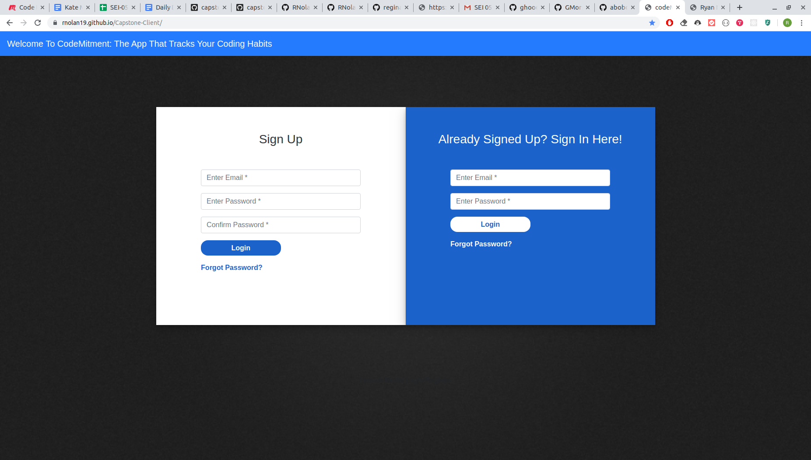
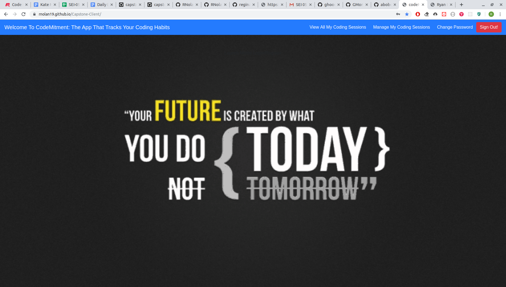
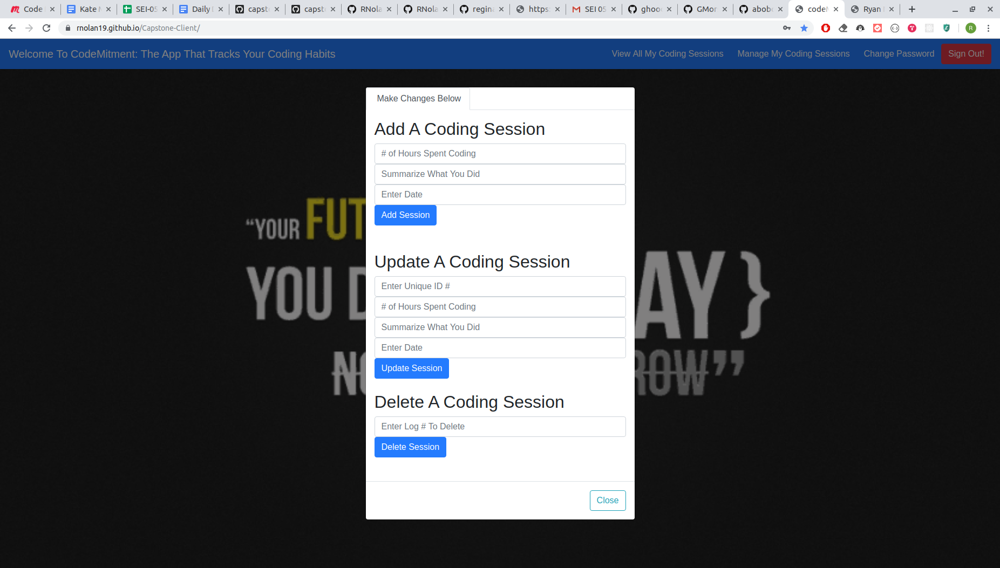
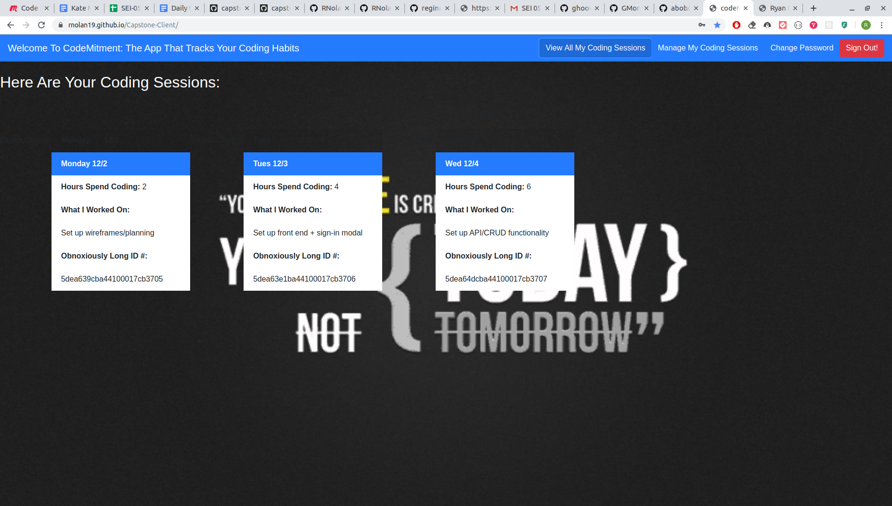
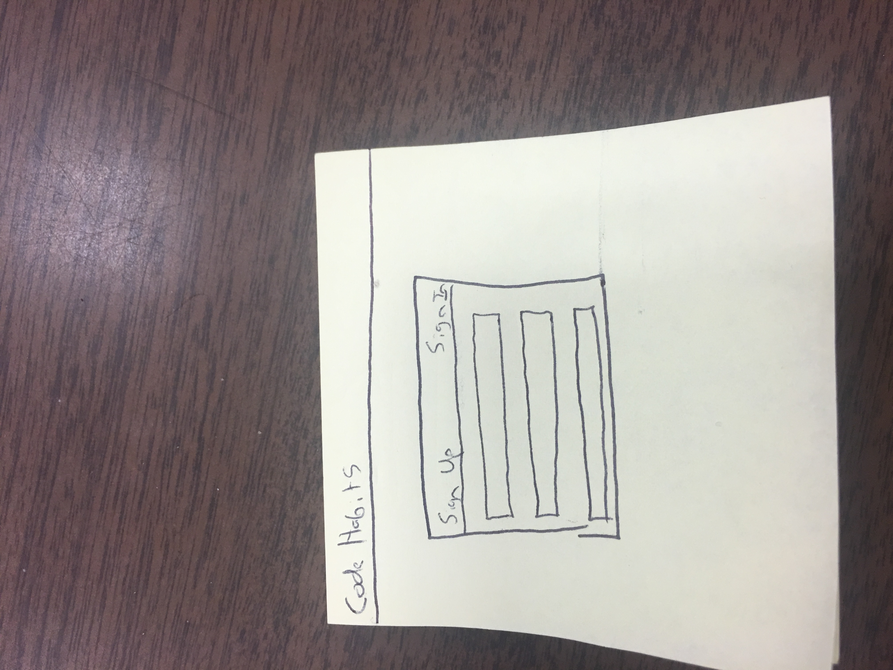
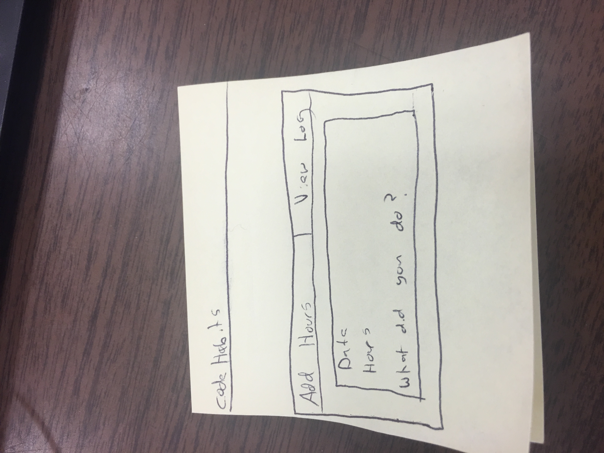
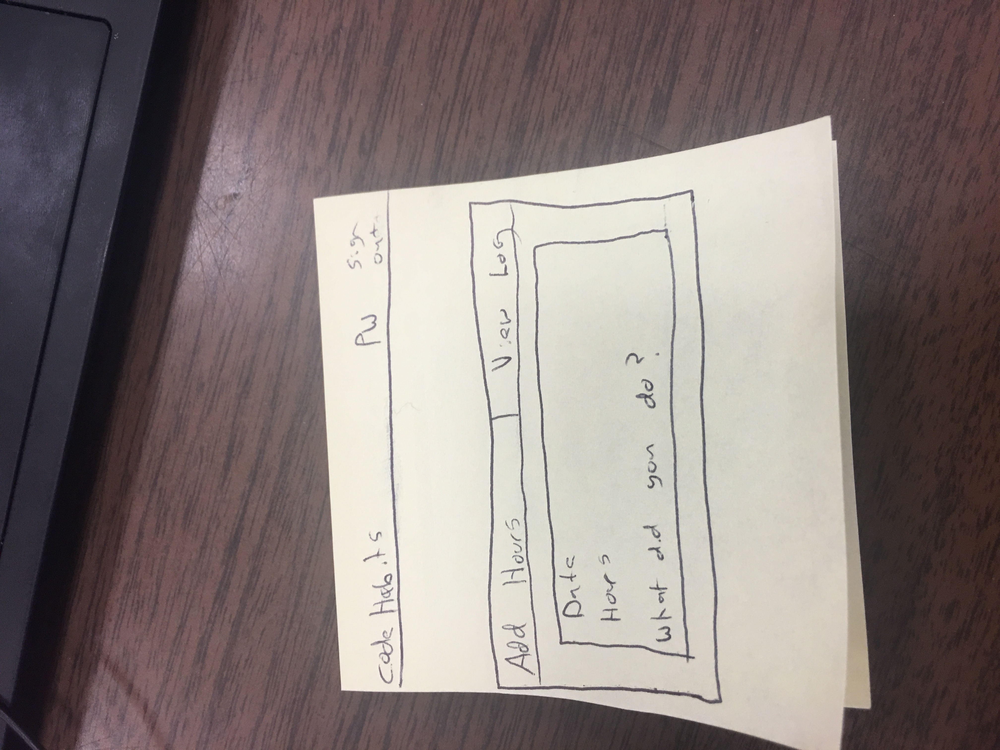

## **Welcome To CodeMitment: The App That Tracks Your Coding Habits**
---------------------------------------------------------------------
**CodeMitment is a single page web application created to help aspiring developers
track how much time they are spending sharpening their coding skills.

I chose to create this app because, selfishly, I wanted a way to track how much
time I was spending improving my coding skills.  I've always been big on tracking
my habits on a calendar, which is something I think I picked up from my father.

Say you make a goal of going for a run 4 times a week,  I've always found it
keeps me accountable and motivated when I have to look at the calendar and see
that I'm slacking for the week.  If it's Thursday and I've only ran once, just
seeing the calendar will make me break out running shoes.  Conversely, when you
look at your calendar at the end of the month and see that you've ran 15+ times
this month, your past accomplishments and dedication give your a nice shot of pride.

So I figured why not do the same thing for coding habits?  Except this time,
trade in the calendar for a website.**

### **Important Links**:
* Please sign in and sign up with a fake email address (ie, ryan@ryan.com)
* [Go Directly To The App Here](https://rnolan19.github.io/Capstone-Client/)

* [Front End GitHub Repo](https://github.com/RNolan19/Capstone-Client)
* [Back End GitHub Repo](https://github.com/RNolan19/Capstone-API)
* [My Deployed API Hosted on Heroku](https://stark-river-21573.herokuapp.com/)

### **Technologies Used on Front-End :**
* JavaScript
* JQuery
* HTML
* CSS
* Bootstrap
* Handlebars
* AJAX
* Git / GitHub
* Curl Scripts

### **Technologies Used on Back-End :**
* Express.js
* Node.js
* MongoDB

### **Setup Steps:**
1. Fork and clone this repository.
2. Run npm install to install all dependencies
4. Use `npm run start` to start the the client on your local host.

### **Planning Story**
After coming up the concept for the project, it was time to create the user
stories, wireframes, and the Entity Relationship Diagram(ERD).  As this is the
4th project, I feel like I have a pretty good idea of how to create quality user
stories and the ERD, but, as an artistically challenged individual, my wireframes
never look very impressive(as seen below).  I know how I want the project to look
in my head, but getting that idea across on a piece of paper is a whole different
issue.

Once the initial planning was concluded, the question became:
what technologies and frameworks did I want to build my app with?
For the back-end, I chose to use Express.js and MongoDB to get more familiarity
working with Express.  For the front-end, I chose to build it with JavaScript, HTML,
CSS, and Bootstrap and to use JQuery and AJAX for the CRUD actions.

I initially intended to set up the back-end first, but after having some issues
with my terminal, I decided to focus on what I could work on: the front-end.
Knowing that the MVP project requirements were to enable users to create an
individual account and then perform CRUD actions on a resource, I made all the
necessary authorization + CRUD forms first.  Once the issues with my terminal
were resolved, I then built the back-end with Express and left the styling
for last.

Although the terminal and API issues were definitely frustrating in the moment,
it was yet another example for me to expect the unexpeted when creating individual
projects or working on teams.  It generally isn't going to go exactly how you
draw it up.  I think that's just something you have to somewhat accept going in.

Overall, I think the project went fairly smoothly.  I don't have a ton of experience
with Handlebars so that was a bit of an adventure, but I now feel way more comfortable
working with Handlebars and setting up the back-end with Express.

### **User Stories**
* As an unregistered user, I would like to be able to sign up for an account with relative ease.
* As a registered user, I would like to be able to sign in, change my password, and sign out.
* As a registered user, I would like to be able to add how many hours I spent coding on a particular day.
* As a registered user, I would like to be able to update and delete how many hours I spent coding, if any changes need to be made.
* As a registered user, I would like to look back and see what I worked on on a particular day.  Was I working on a project? Or studying?  What languages was I using, etc?

### **Screenshots and Wireframes**

### **Future Updates / Stretch Goals**
If alotted more time to work on this project, I'd like to change how the app
currently displays the users' "coding sessions".  The original idea was to have
a dropdown calendar when the user clicked "View My Coding Sessions" and days that
you had logged a session would be highlighted with all of your information within it.
I didn't have the time for that, so I tried to build a more MVP version.

I would also like to find a workaround to needing to enter your ID # to update
or delete a previous log.  The goal is always make the UX as painless as possible
and that is admittedly not the most user-friendly process, so I'd like to change
that too.

I think both of those of changes would greatly improve the user experience.
